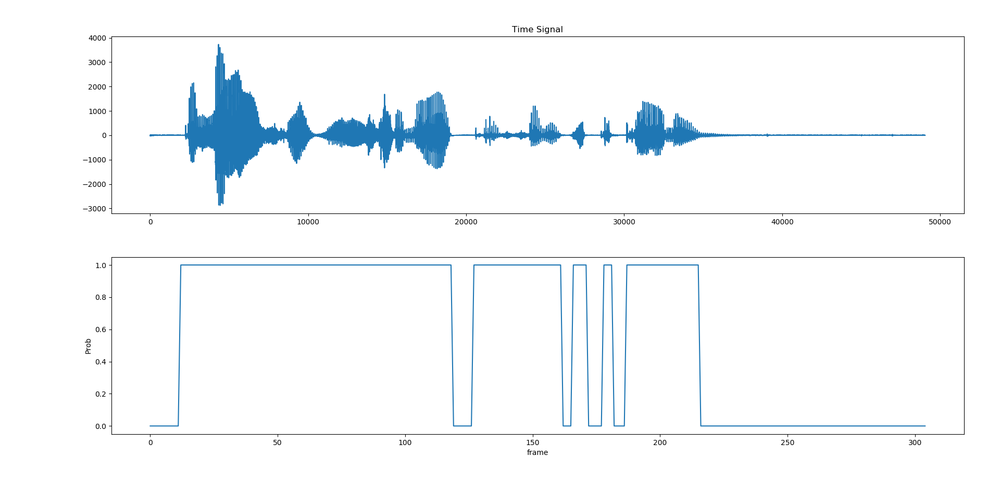

# A statistical model-based Voice Activity Detector

A voice activity detector applied a statistical model has been made in [2], where the decision rule is derived from the likelihood ratio test (LRT) by estimating unknown parameters using the decision-directed method. Hang-over scheme based on the hidden Markov model (HMM) are applied for smoothing.

## Run the demo
```bash
python vad.py
```

## Results



## References
* [1] [J. Sohn, N. S. Kim, and W. Sung. "A statistical model-based voice activity detection," IEEE Signal Processing Letters, Vol. 6, issue 1, pp. 1-3, Jan. 1999.](https://wiki.inf.ed.ac.uk/twiki/pub/CSTR/ListenSemester1_2010_11/sohn_SPL99_statistical_model-based_VAD.pdf)
* [2] [Y. Ephraim and D. Malah, "Speech enhancement using a minimum-mean square error short-time spectral amplitude estimator," IEEE Trans Acoustics Speech and Signal Processing, VOL. 32(6):1109-1121, Dec 1984.](https://ieeexplore.ieee.org/stamp/stamp.jsp?arnumber=1164453)


## TODO(will be uploaded):
- [ ] Q. H. Jo, J. H. Chang, J. W. Shin, and N. S. Kim, “Statistical model-based voice activity detection using support vector machine,”
IET Signal Process., vol. 3, no. 3, pp. 205–210, 2009.
- [ ] X.-L. Zhang and J. Wu, “Deep belief networks based voice activity detection,” IEEE Trans. Audio Speech Lang. Process., vol. 21, no. 4, pp. 697–710, Apr. 2013.
